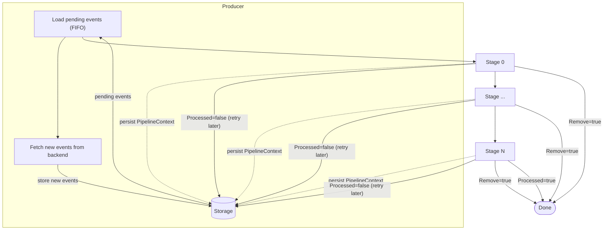

# eventpipe

Package for processing events from Idefix through a configurable pipeline with persistent storage.

## Overview

`eventpipe` fetches events from the Idefix backend and passes them through a chain of user-defined stages. Events and their processing state are persisted in storage (SQLite or in-memory), so the pipeline can resume from where it left off after a restart.

## Architecture



Each event carries a `PipelineContext` that stages can modify. After each stage, the context is persisted to storage. When a stage marks an event as `Processed`, it advances to the next stage (and on restart, that stage is skipped). If a stage does not mark the event as processed, the event is unlocked in storage and re-injected by the producer in the next iteration. If the last stage marks the event as `Processed`, the event is removed from storage (fully done). A stage can set `Remove` to discard the event permanently at any point.

## Components

### EventSourceManager

Entry point. Manages the Idefix client, storage backend, and lifecycle of event sources.

```go
esm, err := eventpipe.NewEventSourceManager(eventpipe.EventSourceManagerParams{
    Client:      idefixClient,
    Context:     ctx,
    Logger:      slog.Default(),
    StoragePath: "events.db",   // use ":memory" for in-memory storage
})
esm.Init()
defer esm.Close()
```

### EventSource

Represents a single event stream. The producer fetches events from Idefix and feeds them into the pipeline. Events are persisted to storage on arrival.

```go
source, err := esm.NewSource(eventpipe.EventSourceParams{
    Id:      "my-source",
    Domain:  "my-domain",
    Address: "device-001",       // optional: filter by device
    Type:    "temperature",      // optional: filter by event type
    Since:   time.Now().Add(-24*time.Hour),
})
```

### EventStage

Interface that each processing stage must implement:

```go
type EventStage interface {
    Process(context.Context, EventStageInput) (EventStageOutput, error)
}
```

Stages are added to the source with `Push()`:

```go
source.Push(&myStage{},
    eventpipe.OptName("stage-name"),
    eventpipe.OptConcurrency(10),
    eventpipe.OptInputBufferSize(5),
)
```

#### EventStageOutput flags

- `Processed = true`: marks the event as processed in this stage. The event advances to the next stage. On restart, stages already marked as processed are skipped. If it's the last stage, the event is removed from storage (fully done).
- `Processed = false` (and `Remove = false`): the event is unlocked in storage and will be re-injected by the producer in the next iteration. It does not advance to the next stage.
- `Remove = true`: immediately removes the event from storage and stops further processing. Takes precedence over `Processed`.

### PipelineContext

Each event carries a `PipelineContext` (map[string]any) that stages can read and modify. This context is persisted to storage after each stage completes, so if the pipeline restarts, the next stage will receive the last persisted context. This enables:

- Passing data between stages (e.g., intermediate computation results).
- Tracking which stages have already processed the event (`processedStages` map).
- Resuming from the exact point where processing stopped.

### Storage

The `storage` sub-package defines the `Storage` interface with two implementations:

- **SQLite** (`"sqlite"`): Persistent storage with WAL mode, schema migrations via `PRAGMA user_version`, and robust PRAGMA settings.
- **Memory** (`"memory"`): In-memory storage for testing.

#### SQLite concurrency note

SQLite is configured with `MaxOpenConns(1)` because SQLite is single-writer by design. Increasing the number of connections would not enable parallel writes -- it would only cause `SQLITE_BUSY` contention errors. With a single connection, Go's `sql.DB` pool serializes all database operations cleanly.

This means that concurrent stage workers (e.g., 25 workers x N stages) will serialize their storage writes (Update, Delete, Lock, Unlock) through this single connection. For stages with non-trivial processing time this is not a bottleneck, since the SQLite operations take microseconds compared to the stage processing time.

If write throughput becomes a concern, consider:
1. Batching multiple updates into a single transaction.
2. Relaxing `PRAGMA synchronous` from `FULL` to `NORMAL` (safe with WAL mode against process crashes).
3. Implementing an alternative `Storage` backend (e.g., PostgreSQL) -- the interface is already decoupled.

## Running the pipeline

```go
// Simple run
err := source.Run()

// Run with metrics
stats, err := source.RunAndMeasure()
fmt.Println(stats.String())
```

## Example

See `examples/events/pipe/` for a working example with mock stages.
